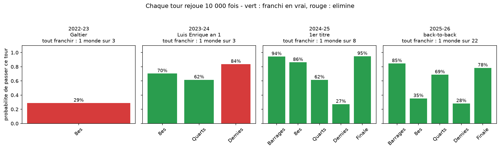
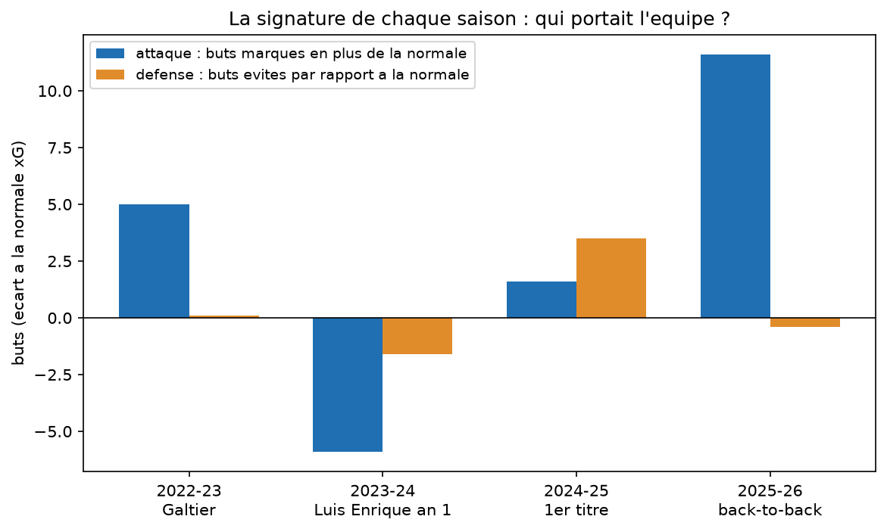
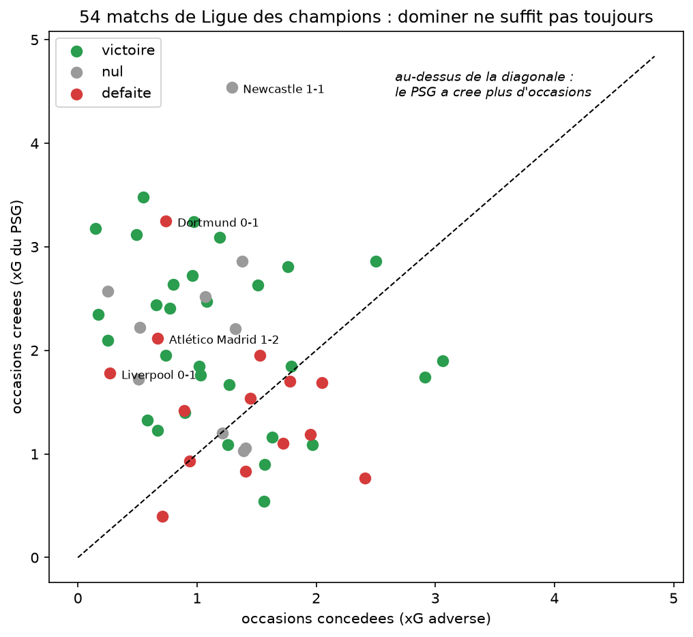
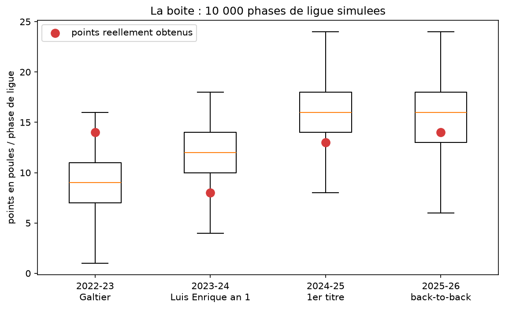

# Back-to-back : le doublé du PSG en Ligue des champions, chance ou domination ?

Le PSG a gagné les Ligues des champions 2025 et 2026. On a pris les xG de
ses 54 matchs européens sur quatre saisons, on a rejoué chaque match
10 000 fois, et on a compté dans combien de mondes le doublé arrive
vraiment.

Pour abréger le suspense : dans 1 monde sur 171. Le PSG a dominé la plupart de
ses matchs, mais il est passé deux fois par des demi-finales qu'il perd
7 fois sur 10, et il a gagné les deux. À l'inverse, la seule demi-finale
que la période lui offrait sur un plateau (Dortmund 2024, 84 % de
qualification), il l'a perdue. Ni pure chance, ni pure domination : une
équipe dominante qui a converti l'improbable aux moments décisifs.

## Fonctionnement

Le xG d'un match, c'est le nombre de buts qu'une équipe « aurait dû »
marquer vu les occasions qu'elle s'est créées. On fait l'hypothèse
classique que les buts suivent une loi de Poisson dont la moyenne est ce
xG : ça permet de rejouer chaque match des milliers de fois en gardant la
performance (les occasions) et en ne faisant varier que la finition. En
enchaînant les matchs rejoués, on obtient la probabilité de franchir
chaque tour, puis celle du parcours entier.

Une précision importante : on rejoue le parcours réel, contre les
adversaires réels, avec les occasions réelles. « 1 monde sur 22 » ne veut
pas dire que le PSG 2025-26 était une équipe à 4,5 % — ça veut dire que
ces matchs-là, avec ces occasions-là, ne donnent le trophée qu'une fois
sur 22. C'est exactement la différence entre performance et résultat
qu'on cherche à mesurer.

## Quatre saisons, quatre signatures

- 2022-23, Galtier : l'attaque convertit très bien (+5 buts au-dessus de
  la normale sur 8 matchs) mais produit peu (1,4 xG par match). Sortie
  contre le Bayern méritée dans les chiffres : 29 % de qualification.
  La seule élimination logique de la période.
- 2023-24, première année Luis Enrique : la saison maudite. L'équipe
  produit beaucoup et ne convertit rien (-5,9 buts sous la normale),
  encaisse plus que ce qu'elle concède. Elle sort en demi-finale contre
  Dortmund alors qu'elle se qualifiait dans 84 % des mondes — la
  confrontation la plus abordable des quatre demi-finales de la période,
  et la seule perdue.
- 2024-25, premier titre : l'année de la défense (3,5 buts évités par
  rapport aux xG concédés). Parcours complet : 1 monde sur 8, avec un
  quart de finale volé par Liverpool à l'aller (défaite 0-1 avec 1,78-0,27
  aux xG, 5 % de probabilité — le résultat le plus improbable des quatre
  saisons) et une demi-finale contre Arsenal gagnée à 27 %.
- 2025-26, le back-to-back : l'attaque en état de grâce, 45 buts marqués
  pour 33 xG (+11,6, du jamais vu sur la période). Parcours complet :
  1 monde sur 22, avec un huitième contre Chelsea gagné 5-2 puis 3-0 en
  étant dominé aux occasions les deux fois, et encore une demi-finale
  (Bayern) passée à 28 %.

## Le point intéressant : la chance n'était pas où on la cherche

En phase de ligue, le PSG du doublé a fait MOINS de points que ses xG
n'en méritaient : 13 réels pour 16,3 attendus en 2024-25, 14 pour 15,6 en
2025-26. Toute la sur-conversion s'est concentrée sur les matchs à
élimination directe. L'ironie : la seule phase de poules chanceuse de la
période est celle de Galtier (14 points pour 9,4 attendus, un scénario à
7 %) — l'équipe qui volait ses poules méritait sa sortie, celles qui
méritaient leurs poules ont surperformé leurs printemps.

Et le threepeat manqué : dans 84 % des mondes, le PSG jouait la finale
2024. Le doublé aurait pu être trois finales de suite. Pour 2026-27, la
saison qui commence, on sait ce que les joueurs doivent aller chercher ;)

## Verdict

Alors, chance ou domination ? Les deux, et c'est ça qui rend ce doublé
énorme. La domination, elle est dans le nuage de points : 54 matchs, la
grande majorité au-dessus de la diagonale. La chance, elle est dans les
grands soirs : deux demi-finales gagnées à 27 et 28 %, un huitième
retourné contre le cours du jeu, une finale arrachée aux tirs au but.

Mais renversons la question une seconde. Un monde sur 171, ce n'est pas
le chiffre d'une équipe chanceuse — la chance ne repasse pas deux
printemps de suite aux mêmes endroits. C'est le chiffre d'une équipe qui
a produit assez, pendant quatre ans, pour se retrouver chaque année dans
les matchs qui comptent, et qui, arrivée là, a mis les buts que les xG ne
promettaient pas. Les modèles mesurent les occasions. Ils ne mesurent pas
ce qui fait qu'un tir de Bayern-PSG en avril rentre ou ne rentre pas. Ce
qui vit dans cet écart-là n'a pas de colonne dans un tableau, et c'est
précisément ce que ce projet permet de localiser : on sait maintenant où
regarder.

Le PSG n'a pas eu de la chance. Il a été là où la chance se donne, deux
années de suite. Un monde sur 171 — et c'est le nôtre.

## Les limites

- On rejoue le parcours réel : une autre phase de ligue aurait donné un
  autre classement, d'autres adversaires, un autre arbre. Simuler ça
  demanderait de modéliser les 35 autres équipes — hors périmètre.
- Les tirs au but sont modélisés en pièce équilibrée (50/50 : hypothèse simpliste,
  les serviettes des gardiens nous prouvent l'inverse). Les
  prolongations utilisent les intensités du match retour ramenées à
  30 minutes.
- La sur-conversion mélange talent des finisseurs et réussite : sur 17
  matchs, la statistique ne peut pas les séparer. On mesure l'écart, on
  ne juge pas sa cause.
- Les xG de Sofascore sont un modèle propriétaire ; un autre fournisseur
  donnerait des valeurs légèrement différentes, pas une autre histoire.
- Le périmètre commence en 2022-23 : c'est la première saison de LdC
  couverte par notre source de xG.

## Reproduire

    python -m venv .venv
    source .venv/bin/activate
    pip install -r requirements.txt
    jupyter lab

Ouvrir notebooks/01_back_to_back.ipynb et tout exécuter. La structure des
matchs (tours, adversaires, scores) est téléchargée depuis FBref au
premier lancement (navigateur piloté, quelques minutes, puis cache
local). Les xG sont saisis dans le notebook, relevés à la main.

## Sources

Structure des matchs : FBref (fbref.com), via la bibliothèque soccerdata.
xG : Sofascore (sofascore.com), relevés manuellement match par match —
FBref ne publie plus de statistiques avancées depuis janvier 2026, d'où
la collecte manuelle. Données mises en cache localement, non
redistribuées dans ce dépôt.
Simulation : numpy, loi de Poisson, 10 000 tirages par match, graine
fixée pour la reproductibilité.